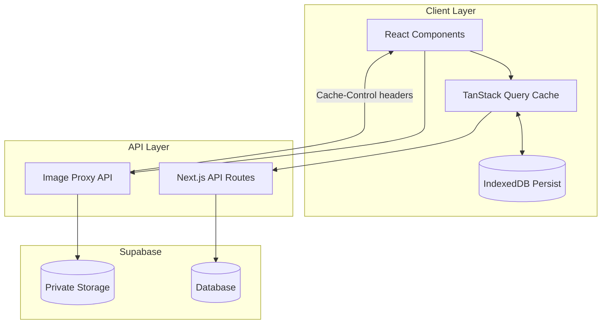

# Caching and Performance Optimization Plan

**Created:** January 13, 2026  
**Status:** Completed (Phase 1-2, 4)

## Current Problems

1. **No client-side caching**: Every page load/navigation refetches all data from Supabase
2. **Polling overhead**: 3-second polling for generating storybooks even when not needed
3. **Private signed URLs**: Change on every request, browser/CDN can't cache
4. **Full-size images everywhere**: Grid views load full-resolution images

## Architecture Overview



## Phase 1: TanStack Query Setup

### 1.1 Install Dependencies

```bash
npm install @tanstack/react-query @tanstack/query-persist-client-core idb-keyval
```

### 1.2 Create Query Provider

Create `lib/providers/query-provider.tsx`:
- QueryClient with smart defaults (staleTime: 5min, gcTime: 30min)
- IndexedDB persister using `idb-keyval`
- Wrap app in provider

### 1.3 Create Query Hooks

Create `lib/queries/` directory with:

| Hook | staleTime | Purpose |
|------|-----------|---------|
| `useStorybooks()` | 2 min | List user's storybooks |
| `useStorybook(id)` | 5 min | Single storybook detail |
| `useCharacters()` | 10 min | List user's characters |
| `useTemplates()` | 30 min | Story templates (rarely change) |
| `useProfile()` | 5 min | User profile |

### 1.4 Smart Polling for Generating Storybooks

Replace 3-second interval polling with:
- `refetchInterval` only when storybooks are in `generating`/`pending` status
- Use Supabase Realtime subscription for status changes (future enhancement)

### 1.5 Refactor Components

Update these components to use query hooks instead of `useEffect` + fetch:
- `components/storybooks-tab.tsx`
- `components/characters-tab.tsx`
- `components/story-library-tab.tsx`
- `components/profile-tab.tsx`

## Phase 2: Image Proxy for Private Storage

Since images must stay private, we need a caching proxy.

### 2.1 Create Image Proxy API

Create `app/api/v1/images/route.ts`:

```typescript
// GET /api/v1/images?bucket=storybook-scenes&path=abc/scene-1.jpg&w=400
// 1. Validate user owns the resource (check storybook ownership)
// 2. Fetch from Supabase Storage
// 3. Optionally resize (for thumbnails)
// 4. Return with Cache-Control: private, max-age=3600
```

Key features:
- Validates user ownership before serving
- Returns stable URL (same URL = browser caches it)
- Sets `Cache-Control: private, max-age=3600` (1 hour browser cache)
- Optional width parameter for on-the-fly thumbnails

### 2.2 Update Image URLs in API Responses

Modify storybook/character API routes to return proxy URLs:
```
/api/v1/images?bucket=storybook-scenes&path=123/scene-1.jpg
```
Instead of signed URLs that change every request.

## Phase 3: Thumbnail Generation

### 3.1 Generate Thumbnails on Storybook Completion

Modify `lib/services/storybook-generator.ts`:
- After generating scene 1, also create a 400px thumbnail
- Store as `{storybookId}/thumbnail.jpg`

### 3.2 Use Thumbnails in Grid Views

Update storybook listing to use thumbnail URLs for cards:
- Grid view: `/api/v1/images?bucket=storybook-scenes&path=123/thumbnail.jpg`
- Full reader: `/api/v1/images?bucket=storybook-scenes&path=123/scene-1.jpg`

## Phase 4: API Response Caching

### 4.1 Add Cache-Control Headers

For static-ish data like story templates:

```typescript
// app/api/v1/story-templates/route.ts
return NextResponse.json(data, {
  headers: {
    'Cache-Control': 'public, s-maxage=300, stale-while-revalidate=600',
  },
})
```

## Expected Impact

| Metric | Before | After |
|--------|--------|-------|
| DB calls on navigation | Every page load | Cached, refetch on stale |
| Image fetches | Every render | Browser cached 1hr |
| Polling frequency | Always 3s | Only when generating |
| Grid image size | Full res (~500KB) | Thumbnail (~50KB) |

## Files to Create/Modify

**New Files:**
- `lib/providers/query-provider.tsx`
- `lib/queries/use-storybooks.ts`
- `lib/queries/use-characters.ts`
- `lib/queries/use-templates.ts`
- `lib/queries/use-profile.ts`
- `lib/queries/index.ts`
- `app/api/v1/images/route.ts`

**Modified Files:**
- `app/layout.tsx` - wrap with QueryProvider
- `components/storybooks-tab.tsx` - use query hooks
- `components/characters-tab.tsx` - use query hooks
- `components/story-library-tab.tsx` - use query hooks
- `components/profile-tab.tsx` - use query hooks
- `lib/services/storybook-generator.ts` - add thumbnail generation
- `app/api/v1/storybooks/route.ts` - use proxy URLs
- `app/api/v1/characters/route.ts` - use proxy URLs

## Future Enhancements (Not in this plan)

1. **Supabase Realtime**: Replace polling with real-time subscriptions
2. **Service Worker**: Cache API responses at the network level
3. **Web Landing Page**: Separate marketing site (Phase 2 of original request)

---

## Implementation Log

### Phase 1: TanStack Query Setup - COMPLETED
- [x] Install dependencies (`@tanstack/react-query`, `@tanstack/react-query-persist-client`, `idb-keyval`)
- [x] Create QueryProvider with IndexedDB persistence (`lib/providers/query-provider.tsx`)
- [x] Create query hooks:
  - `lib/queries/use-storybooks.ts` - staleTime: 2 min, smart polling
  - `lib/queries/use-characters.ts` - staleTime: 10 min
  - `lib/queries/use-templates.ts` - staleTime: 30 min
  - `lib/queries/use-profile.ts` - staleTime: 5 min
- [x] Refactor components:
  - `components/storybooks-tab.tsx`
  - `components/characters-tab.tsx`
  - `components/story-library-tab.tsx`
  - `components/profile-tab.tsx`

### Phase 2: Image Proxy - REVERTED
- [x] Create image proxy API (`app/api/v1/images/route.ts`) - Created but not used
- [x] Created helper utilities (`lib/utils/image-proxy.ts`) - Created but not used
- **REVERTED**: Proxy URLs don't work with `` tags because browsers don't send Authorization headers for image requests
- **SOLUTION**: Keep using signed URLs for images. The TanStack Query caching still provides significant benefits for API data.

**Note**: A future enhancement could use cookie-based auth for the image proxy, or generate longer-lived signed URLs.

### Phase 3: Thumbnails - SKIPPED
- [ ] Add thumbnail generation (deferred - requires more complex changes)
- [ ] Update grid views to use thumbnails

### Phase 4: API Caching - COMPLETED
- [x] Add Cache-Control headers to static APIs:
  - `app/api/v1/story-templates/route.ts` - s-maxage=300
  - `app/api/v1/subscription-plans/route.ts` - s-maxage=300
  - `app/api/v1/character-looks/route.ts` - s-maxage=300

